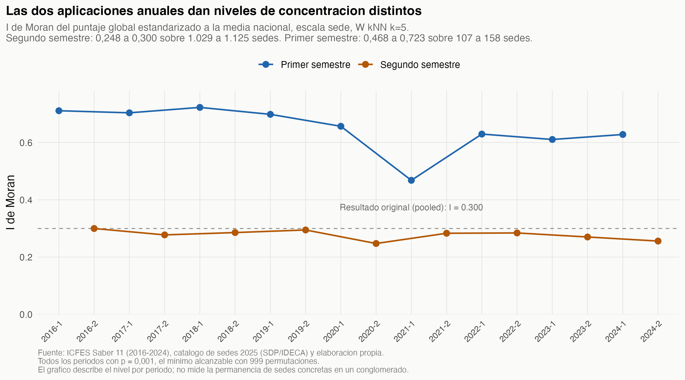
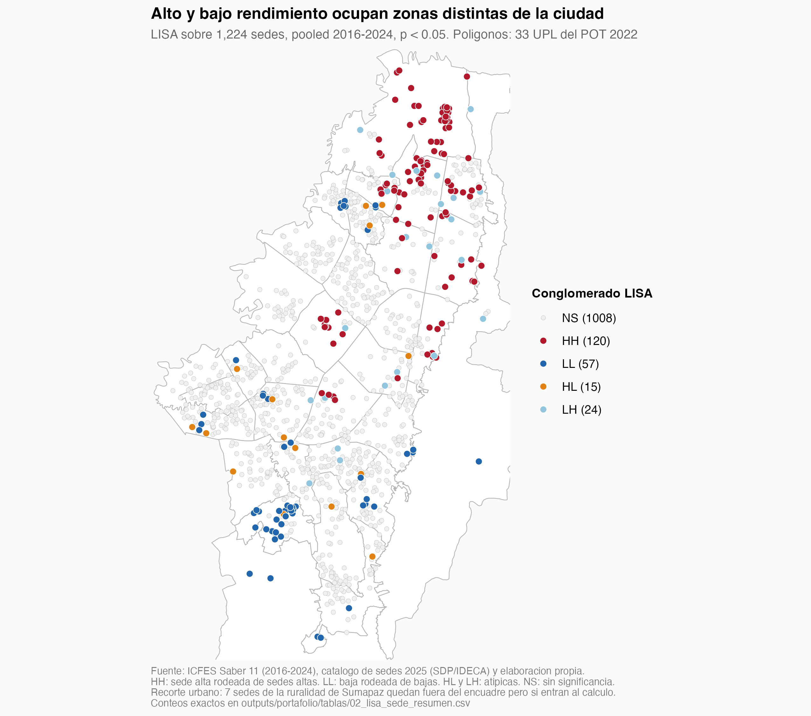
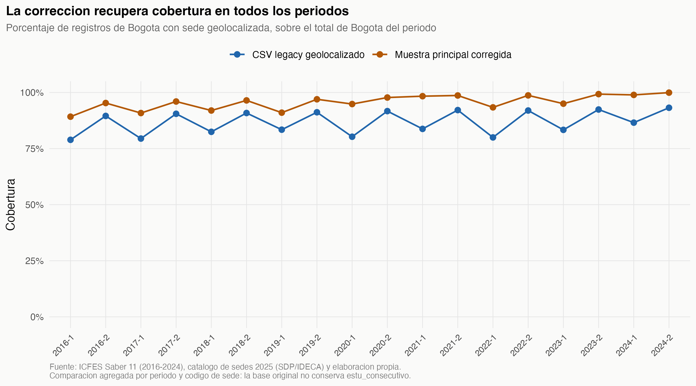
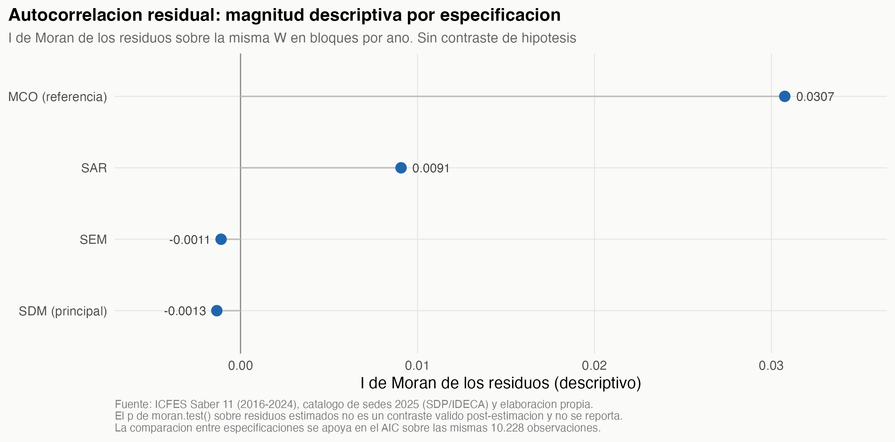
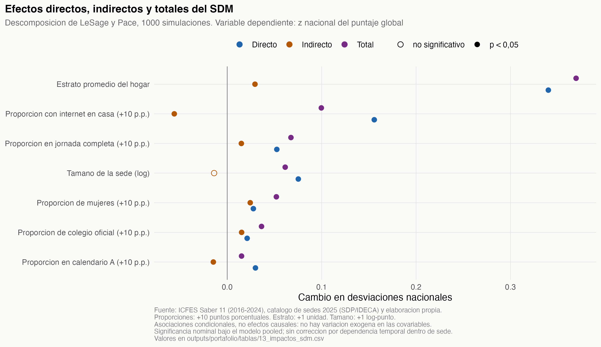
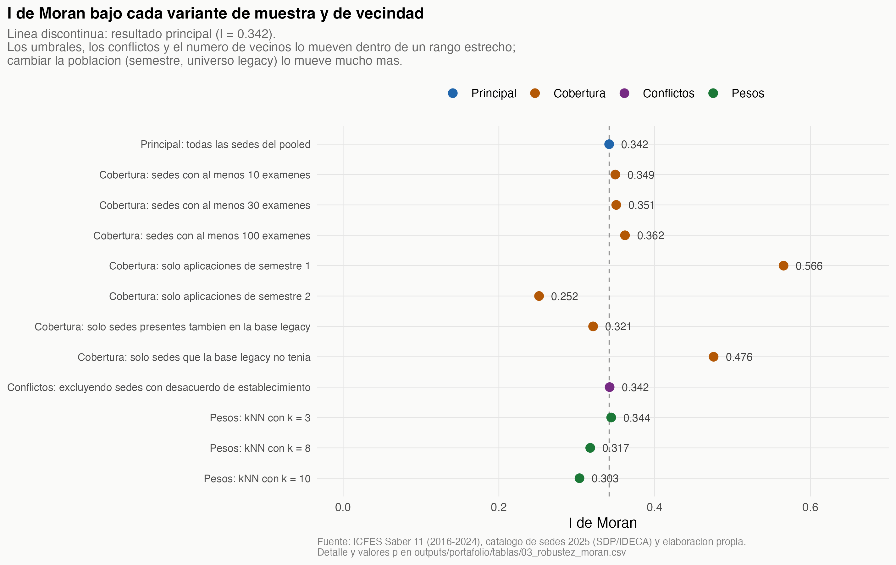

# Concentración espacial del rendimiento escolar en Bogotá

**Caso de análisis sobre 5,98 millones de presentaciones del Saber 11 (2016–2024).**
Reconstrucción auditable de la base, medición de la concentración territorial del
desempeño, modelación espacial, y cuantificación de cuánto cambia la medición al
corregir la cadena de vinculación geográfica.

> El informe original del equipo se conserva íntegro en
> [`notebooks/main_report.Rmd`](notebooks/main_report.Rmd) y su README en
> [`docs/README_equipo_original.md`](docs/README_equipo_original.md).

---

## La pregunta

> ¿Qué tan concentrado espacialmente está el rendimiento escolar en Bogotá, y cuánto
> de la concentración medida depende de cómo se vinculan los colegios con su ubicación?

## El resultado, en corto

El rendimiento está concentrado: **I de Moran = 0,342** (p = 0,001, 999 permutaciones)
sobre 1.224 sedes. 120 sedes forman conglomerados de alto rendimiento y 57 de bajo. La
estructura espacial no es ruido: entre cuatro especificaciones sobre las mismas 10.228
observaciones, el modelo que la incorpora en ambos canales **baja el AIC en 152 puntos**
frente a mínimos cuadrados.

La reconstrucción incorpora 92 sedes adicionales respecto de la muestra analítica original,
y el I pasa de 0,300 a 0,342. Es una comparación entre especificaciones: cambian la
población de referencia del z-score, el conjunto de sedes y sus vecinos. El cambio no
puede atribuirse únicamente a la corrección del cruce.

## Para qué sirve

Para orientar dónde mirar: los conglomerados son compactos e identificables, y el mapa
permite ubicarlos. Para dimensionar: el estrato del hogar y el acceso a internet son las
covariables con mayor asociación directa. Y para auditar: la cadena entera se reconstruye
con un comando y se bloquea sola si una validación falla.

## Qué no sostiene

No sostiene afirmaciones causales: no hay variación exógena en ninguna covariable. No
sostiene una lista de asignación de recursos: el mapa LISA es exploratorio, sin ajuste por
comparaciones múltiples. No sostiene geocodificación histórica: el catálogo es de 2025 y se
aplica a resultados desde 2016.

---

## Qué encontré en el pipeline original

Tres defectos encadenados, verificados en el código y en los artefactos que produjo:

| Defecto | Evidencia | Qué afecta |
|---|---|---|
| `as.integer()` sobre códigos DANE de 12 dígitos | Desbordan el entero de 32 bits y devuelven `NA` | El nivel de cruce exacto por código produjo **0 coincidencias** |
| Selección por nombre a nivel de establecimiento | `mapa_homologacion_colegios.csv`: 945 por nombre exacto, 168 por Levenshtein, 0 por código | Determina **qué presentaciones entran** a la muestra analítica |
| Estandarización dentro de la muestra | `scale()` aplicado tras filtrar Bogotá (§19.2) | El z se describe como posición nacional pero mide posición dentro de Bogotá |

**Alcance de la atribución.** La geometría final del estudio original no se construyó por
nombres: la sección 19.3 del informe arma `sf_sede` desde el GeoPackage por `DANE12_SED`.
Lo que el emparejamiento por nombre determinó fue la *selección* de registros que llegaron
a esa etapa. El informe también publicaba el conteo de cruces por nivel y validaba los
momentos del z-score con `stopifnot`: el resultado de cero cruces por código era visible en
su salida.

Lo que este trabajo añade, entonces, es acotado: conecta esos diagnósticos como compuertas
que detienen una entrega inválida, y corrige la población de referencia del z-score.

---

## Datos

| | |
|---|---|
| Fuente | Microdatos ICFES Saber 11, 18 aplicaciones de 2016-1 a 2024-2 |
| Volumen | 5.982.829 registros nacionales, ~3,6 GB |
| Unidad | **Una presentación del examen** (`periodo` + `estu_consecutivo`), no una persona |
| Catálogo geográfico | `colegios06_2025.gpkg`: 2.221 sedes, 1.871 establecimientos (SDP/IDECA, corte 2025-06-30) |
| Capas territoriales | 112 polígonos UPZ, 33 polígonos UPL del POT 2022 |

Dos hechos del insumo que condicionan todo lo demás:

- **874.112 registros nacionales (14,6 %) no tienen código de colegio.** La proporción es
  de 67–76 % en las aplicaciones de primer semestre y de 6–11 % en las de segundo. Sin
  código de colegio no pueden clasificarse como Bogotá, porque la regla territorial depende
  de la ubicación del colegio. *No dispongo de una fuente que caracterice quiénes son esos
  registrantes; describo el patrón observado sin atribuirle una explicación.*
- **El catálogo declara EPSG:3857 pero almacena grados.** Reproyectar desplazaría todas las
  sedes; hay que corregir la etiqueta, no transformar. El README del equipo original ya
  documentaba esta anomalía.

---

## Metodología

**Reconstrucción.** Códigos DANE como texto en todas las etapas. Vinculación exclusiva por
`cole_cod_dane_sede = DANE12_SED`, igualdad exacta. Los nombres solo generan candidatos de
revisión manual.

**Estandarización.** Por periodo, sobre la población nacional elegible y **antes** de
filtrar Bogotá:

```
z = (punt_global − media_nacional_del_periodo) / sd_nacional_del_periodo
```

**Medición de concentración.** I de Moran global con 999 permutaciones y LISA, sobre la
media por sede del puntaje estandarizado, en EPSG:3116, con W kNN k=5 estandarizada por
filas. Mismas convenciones del estudio original, para que la comparación sea válida.

**Modelación.** Panel pooled sede-año (10.228 observaciones, 1.224 sedes, 9 años) con
efectos fijos de año y W en bloques por año. Cuatro especificaciones: MCO como referencia,
SAR, SEM y **Spatial Durbin Model como principal**. Efectos directos, indirectos y totales
por la descomposición de LeSage y Pace con 1.000 simulaciones.

**Todo lo que se reporta son asociaciones.** No hay variación exógena en las covariables;
ningún coeficiente admite lectura causal.

Detalle completo en [`docs/NOTA_METODOLOGICA.md`](docs/NOTA_METODOLOGICA.md).

---

## Resultados

### 1. El rendimiento está concentrado espacialmente, y el nivel es estable

I de Moran = **0,342**, p = 0,001 (el mínimo alcanzable con 999 permutaciones), sobre 1.224
sedes, pooled 2016–2024. En las nueve aplicaciones de segundo semestre —la aplicación
masiva, con 1.029 a 1.125 sedes— el valor se mantiene entre 0,248 y 0,300.

Las aplicaciones de primer semestre dan valores más altos (0,468 a 0,723) sobre conjuntos
mucho más pequeños, de 107 a 158 sedes. Son poblaciones distintas, no la misma serie.



### 2. Los conglomerados reproducen la división norte–sur

Sobre el agregado 2016–2024: 120 sedes en conglomerados de alto rendimiento (7,5 % de las
presentaciones) y 57 en conglomerados de bajo rendimiento (5,0 %).

La diferencia entre la media no ponderada de las sedes HH (z = 1,275) y la de las sedes LL
(z = −0,158) es de **1,43 unidades z**. Es una diferencia descriptiva entre dos grupos
seleccionados por el propio LISA, no un efecto. No la convierto a puntos del Saber 11: la
desviación nacional varía entre 47,6 y 59,6 según el periodo, y una mezcla de z de periodos
distintos no tiene una conversión única.



> **El mapa es exploratorio.** LISA usa el p analítico de `localmoran()` sin ajuste por
> comparaciones múltiples. No es una lista validada para asignar recursos. El LISA se
> calculó sobre el agregado de nueve años: no describe la permanencia de sedes concretas en
> un conglomerado a lo largo del tiempo, que no se estimó.

### 3. Comparación descriptiva entre especificaciones

| Especificación | Sedes | I de Moran |
|---|---:|---:|
| Estudio original, z interno a Bogotá | 1.132 | 0,300 |
| Mismas sedes, z nacional y coordenadas de sede | 1.132 | 0,321 |
| Añadiendo las sedes ausentes del cruce por nombre | 1.224 | **0,342** |

**Es una comparación descriptiva entre especificaciones, no una descomposición
identificada.** Las tres filas difieren simultáneamente en más de un aspecto —variable
dependiente, conjunto de unidades y vecinos recalculados— y coincidir en el número de
sedes no certifica que las demás condiciones del contraste sean iguales.

Sobre cobertura, conviene distinguir dos referencias:

| Referencia | Presentaciones | Sedes |
|---|---:|---:|
| CSV legacy geolocalizado | 719.466 | 1.149 |
| Muestra analítica final del estudio original (tras su filtro espacial) | 716.279 | 1.132 |
| Muestra principal corregida | 770.319 | 1.224 |

Frente al CSV legacy la diferencia neta es de 50.853 presentaciones (54.040 en sedes que el
legacy no tenía, menos 3.187 en 17 sedes legacy sin coordenada plausible). Frente a la
muestra analítica final del original, la diferencia es de 54.040. En las 1.132 sedes
comunes **no hay ninguna diferencia de conteo** por periodo × sede entre ambas bases.



### 4. El modelo espacial: el SDM domina a las alternativas

| Modelo | log-verosimilitud | AIC | I de Moran de los residuos |
|---|---:|---:|---:|
| MCO (referencia) | −4582,5 | 9198,9 | 0,0308 |
| SAR | −4571,1 | 9178,3 | 0,0091 |
| SEM | −4569,4 | 9174,9 | −0,0011 |
| **SDM (principal)** | **−4498,5** | **9047,1** | −0,0013 |

**El SDM se elige por el AIC**, que es el más bajo de las cuatro especificaciones sobre las
mismas 10.228 observaciones, con una distancia de 152 puntos frente a mínimos cuadrados.
ρ = 0,0609 (ee 0,0145).

La columna de I de Moran residual es **descriptiva**: pasa de 0,031 en mínimos cuadrados a
prácticamente cero en SEM y SDM. No lleva valores p, porque `moran.test()` sobre residuos
estimados no es un contraste válido después de estimar; un p alto tampoco probaría
independencia.





Efectos en desviaciones nacionales, con 1.000 simulaciones. **Las proporciones viven entre
0 y 1**, así que se presentan por un aumento de 10 puntos porcentuales; el estrato, por una
unidad:

| Covariable | Unidad | Directo | Indirecto | Total |
|---|---|---:|---:|---:|
| Estrato promedio del hogar | +1 unidad | 0,340 | 0,029 | 0,369 |
| Proporción con internet en casa | +10 p.p. | 0,156 | −0,056 | 0,100 |
| Proporción en jornada completa | +10 p.p. | 0,053 | 0,015 | 0,067 |
| Proporción de colegio oficial | +10 p.p. | 0,021 | 0,015 | 0,036 |

Todos los efectos directos con p < 0,001; los indirectos, salvo el del tamaño de la sede.
Los efectos indirectos recogen la propagación completa de la matriz de pesos, no solo los
vecinos inmediatos. Son asociaciones entre agregados sede-año.

> Los errores estándar y p se interpretan bajo los supuestos de la especificación pooled.
> No se aplicó una corrección específica por dependencia temporal entre observaciones de
> una misma sede; las simulaciones de impactos propagan la covarianza del modelo ajustado.

**Comprobaciones dirigidas sobre el modelo.** Excluir las 26 sedes con conflicto de
establecimiento deja ρ en 0,059; exigir 30 presentaciones por sede-año lo sube a 0,139;
k = 3 lo baja a 0,033 y k = 8 lo sube a 0,083. El signo y la significancia se mantienen; la
magnitud depende de la definición de vecindad y de la masa mínima por unidad.

**Comprobaciones dirigidas sobre la concentración.** Al variar el umbral de presentaciones
por sede, excluir las sedes en conflicto y cambiar el número de vecinos (k = 3, 5, 8, 10),
el I de Moran se mueve entre **0,304 y 0,362**. Cambiar la población lo mueve bastante más:
0,566 solo con primer semestre, 0,252 solo con segundo, 0,321 restringido al universo
legacy y 0,476 en las 92 sedes recuperadas. No son la misma serie bajo otra especificación:
son conjuntos de unidades distintos, con vecinos recalculados en cada caso.



---

## Implicaciones

**Para quien use estos datos.** En estos datos y con esta W, incorporar estructura espacial
mejora el ajuste de forma sustantiva: el AIC cae 152 puntos y el I de Moran residual pasa
de 0,031 a cero. No afirmo que esto se generalice a cualquier modelo sobre estos datos, ni
que los errores estándar de una especificación no espacial estén sesgados: eso no se
contrastó.

**Para quien focalice intervenciones.** Los conglomerados son compactos e identificables.
Sirven para orientar dónde mirar; no constituyen por sí mismos una lista de asignación,
porque el LISA es exploratorio y porque la concentración es compatible tanto con un efecto
del entorno como con la ordenación residencial de las familias por ingreso. Este diseño no
las separa.

**Para quien construya pipelines.** El defecto que importa no es que faltara un diagnóstico
—el informe original mostraba el conteo de cruces por nivel— sino que ningún diagnóstico
detenía la entrega. Aquí un fallo de validación invalida las afirmaciones publicadas y
bloquea el análisis posterior.

---

## Limitaciones

1. **La geografía es armonizada, no histórica.** Catálogo de sedes de 2025-06-30 aplicado a
   resultados de 2016–2024.
2. **Asociación, no causalidad.** No hay diseño de identificación en ninguna etapa.
3. **La comparación con la base original es agregada.** El CSV heredado no conserva
   `estu_consecutivo`; la comparación es por periodo y código de sede.
4. **El LISA no está ajustado por comparaciones múltiples** y se calculó sobre el agregado
   de nueve años.
5. **14.114 presentaciones en 26 sedes** tienen desacuerdo entre el establecimiento que
   reporta el ICFES y el que el catálogo asocia a esa sede. Se registran, no se corrigen.
6. **20.754 presentaciones de Bogotá (2,6 %) quedan fuera** de la muestra principal:
   20.753 con código de sede válido sin coincidencia en el catálogo, más 1 con código
   inválido.
7. **51 pares de sedes comparten coordenada exacta** en el catálogo, lo que obliga a
   `knearneigh` a resolver empates arbitrariamente.
8. **La comparación territorial no aísla el tipo de asignación.** UPZ por atributo del
   catálogo agrupa 110 unidades y por cruce espacial 104, con centros y vecinos distintos;
   la diferencia de I (0,467 frente a 0,433) refleja las tres cosas a la vez.
9. **`prop_bilingue` quedó fuera de la especificación principal**: no se reporta en el
   20,6 % de las sede-año, y su ausencia se concentra en sedes pequeñas.
10. **La ventana de plausibilidad de coordenadas es un rectángulo**, no el límite
    administrativo de Bogotá: la prueba verifica pertenencia a esa ventana, no al Distrito.

---

## Mi contribución

Participé en la teoría, la planificación, el código y el análisis del proyecto original,
desarrollado con **Leandro Castellanos, Esteban Labastidas, David Olaya, Luisa Perdomo y
Laura Pinzón** en la Maestría en Economía Aplicada de la Universidad de los Andes. El
diseño econométrico espacial, la convención cartográfica EPSG:3116, la estrategia de
agregación multiescala y la aplicación Shiny original son trabajo colectivo de ese equipo.

Lo que añadí en esta fase: la auditoría que identificó los defectos de la cadena de
vinculación, la reconstrucción de la base con validación que bloquea la entrega ante
fallos, la medición corregida con sus comprobaciones dirigidas, y la reestimación de una
especificación espacial sobre la base corregida.

---

## Reproducción

### Explorar la app con los resultados incluidos

La app usa los agregados incluidos en `shiny_corregido/data/`: para abrirla no hace falta
obtener los microdatos ni ejecutar de nuevo el análisis. Requiere R y los paquetes
indicados en [`shiny_corregido/README.md`](shiny_corregido/README.md).

Desde la raíz del proyecto:

```bash
R -e 'shiny::runApp("shiny_corregido", launch.browser = TRUE)'
Rscript shiny_corregido/test_app.R           # 26 comprobaciones del servidor y del widget
```

El mapa base requiere conexión a internet para cargar las teselas de OpenStreetMap.
La revisión visual se cerró por confirmación de David el 6 de octubre de 2026; alcance y
procedencia en [`app_verificacion.md`](outputs/portafolio/evidencia/app_verificacion.md).

### Reconstruir el análisis desde los insumos originales

Requiere los insumos externos y privados documentados en
[`docs/INSUMOS.md`](docs/INSUMOS.md). No están incluidos en este paquete público.
Con los insumos y paquetes disponibles, ejecutar desde la raíz:

```bash
bash run_analisis.sh
```

Ejecuta `01` reconstrucción → `02` validación de la Fase 1 → `03` validación directa del
parquet → `04` análisis espacial → `05` modelos → `06` exportación para Shiny.
Se detiene ante el primer fallo.

Si `02` o `03` fallan, `VALIDATED_CLAIMS.md` se emite vacío, el estado de validación queda
`INVALIDA` y `04`, `05` y `06` se niegan a ejecutarse.

Entorno comprobado: macOS, R 4.4.0.

---

## Estructura

```
R/
├── 01_reconstruir_base_geocodificada.R   reconstrucción desde los TXT originales
├── 02_validar_fase1.R                    16 pruebas de integridad + reportes
├── 03_validar_parquet.R                  23 pruebas directas sobre la base
├── 04_analisis_principal.R               Moran, LISA, robustez y figuras
├── 05_modelos.R                          MCO, SAR, SEM, SDM, impactos, diagnósticos
├── 06_exportar_shiny.R                   agregados para la app
└── utils/validation_helpers.R            utilidades y compuertas de validación

outputs/
├── audit/fase1/                          evidencia de validación
└── portafolio/{tablas,figuras,modelos}/  resultados del caso

shiny_corregido/                          app sobre resultados corregidos
shiny/                                    app original del equipo (intacta)
notebooks/main_report.Rmd                 informe original del equipo (intacto)
docs/                                     nota metodológica, insumos, decisiones, entrevista
```

Los microdatos y la base auditada viven en `data/`, excluidos de control de versiones.
